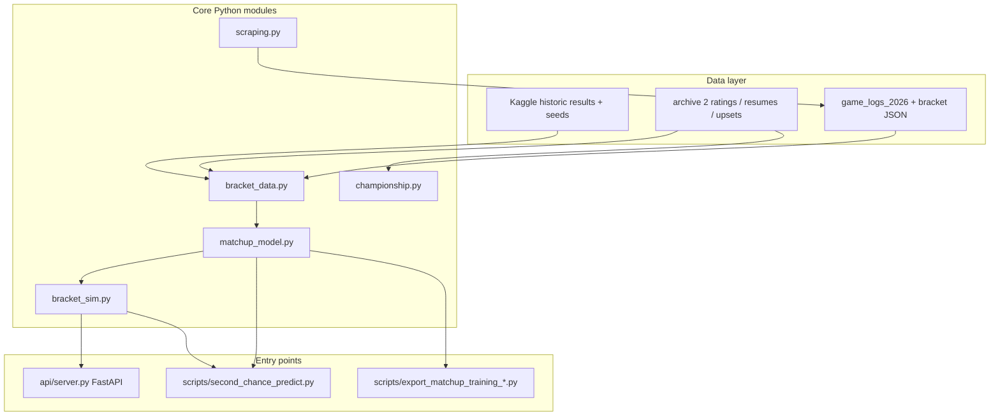

## March Madness Bracket Predictor – Python, scikit-learn, FastAPI

An end-to-end **NCAA tournament prediction and simulation** pipeline: historic Kaggle and rating data are joined into matchup-level features, a **logistic regression** model estimates **P(team A wins)**, and Monte Carlo bracket simulators propagate winners through the full 68-team field (or a Sweet 16 “second chance” slate). A **FastAPI** backend exposes round-of-64 matchups and full-bracket simulation for a hosted frontend.

---

### Features

- **Matchup win-probability model** – Trained on tournament games (2008–2025) with seed, resume, KenPom/Barttorvik, upset-rate, head-to-head, recent form, and path-strength signals  
- **Full-bracket Monte Carlo simulation** – Thousands of runs with configurable temperature, hybrid deterministic/stochastic game resolution, and champion frequency output  
- **2026 live bracket support** – Current-season game logs, Sweet 16 path data, and JSON-driven region slates for post–First Four updates  
- **Championship scoring** – Separate title-probability module combining ratings, seed history, program pedigree, and conference strength  
- **ESPN scraping** – Schedule/game-log ingestion to refresh 2026 head-to-head and form features  
- **REST API** – `GET /health`, `GET /matchups/r64`, `POST /simulate` for integration with a web UI  
- **Training exports** – Scripts to materialize matchup training CSVs (all rounds or by round) for analysis and debugging  

---

### Architecture



| Layer | Module / path | Role |
| --- | --- | --- |
| **Data** | `src/bracket_data.py` | Loads and joins Kaggle compact results, `MTeams`, seeds, resumes, KenPom, upset tables, and 2026 game logs; builds H2H and form indexes |
| **Features** | `src/features.py` | Baseline matchup frame builder (seed and rating diffs) for early-round experiments |
| **Model** | `src/matchup_model.py` | Builds training matrix from historic games, fits **LogisticRegression**, exposes `predict_proba` and 2026 feature rows |
| **Simulation** | `src/bracket_sim.py` | Loads 2026 context, scores each game, advances winners R64 → championship; supports temperature and hybrid sampling |
| **Championship** | `src/championship.py` | Weighted z-score title model from multi-source team strength signals |
| **Scraping** | `src/scraping.py` | ESPN schedule parser for updating `game_logs_2026.csv` |
| **API** | `api/server.py` | FastAPI app; warms model context on startup |
| **Scripts** | `scripts/` | CLI bracket runs, training CSV export, team-name alignment |

**Simulation flow (one game):** `bracket_sim` calls `matchup_model.build_2026_feature_row` → logistic model returns **P(team_a wins)** → optional temperature scaling → hybrid rule (50% deterministic pick at ≥0.5, else Bernoulli sample) → winner advances.

Design notes for the matchup model live in [`docs/matchup_model_design.md`](docs/matchup_model_design.md). Deployment steps for the API are in [`docs/HOSTING.md`](docs/HOSTING.md).

---

### Project layout

```
March_Madness/
├── api/server.py              # FastAPI backend
├── src/
│   ├── bracket_data.py        # Data loading & joins
│   ├── matchup_model.py       # Training + inference
│   ├── bracket_sim.py         # Full-bracket Monte Carlo
│   ├── championship.py        # Title probability scoring
│   ├── features.py            # Matchup feature helpers
│   ├── model.py               # Baseline round-1 logistic (legacy)
│   └── scraping.py            # ESPN game-log scraper
├── scripts/
│   ├── second_chance_predict.py
│   ├── export_matchup_training_df.py
│   └── export_matchup_training_by_round.py
├── data/
│   ├── historic_data/         # Kaggle compact results
│   ├── archive 2/             # Ratings, resumes, upset tables
│   ├── bracket_data/          # Seeds, teams, live bracket JSON
│   └── derived/               # Exported training CSVs
└── docs/
```

---

### Running locally

**Second-chance / Sweet 16 bracket (CLI):**

```bash
cd March_Madness
python3 scripts/second_chance_predict.py --sims 5000 --temperature 1.0
```

Optional flags: `--pure-stochastic`, `--json path/to/bracket.json`, `--seed N`.

**Export training data:**

```bash
python3 scripts/export_matchup_training_df.py
python3 scripts/export_matchup_training_by_round.py
```

**API (requires FastAPI, uvicorn, pandas, scikit-learn):**

```bash
cd March_Madness
uvicorn api.server:app --reload --host 0.0.0.0 --port 8000
```

Smoke test: `curl http://127.0.0.1:8000/health`

---

### Data sources

- **Kaggle NCAA** – `MNCAATourneyCompactResults`, `MRegularSeasonCompactResults`, `MTeams`, `MNCAATourneySeeds`  
- **Archive ratings** – Resumes, KenPom/Barttorvik, seed/upset history, EvanMiya, 538, and related CSVs under `data/archive 2/`  
- **2026 season** – `game_logs_2026.csv`, `bracket.json`, `sweet16_path_wins_2026.json` for live inference  

---

### Highlights

- Built a **feature-rich logistic matchup model** on 18 seasons of NCAA tournament games with mirrored training rows for symmetry  
- Implemented **Monte Carlo bracket simulation** with temperature and hybrid stochastic/deterministic resolution  
- Exposed predictions through a **FastAPI** service suitable for a hosted bracket UI  
