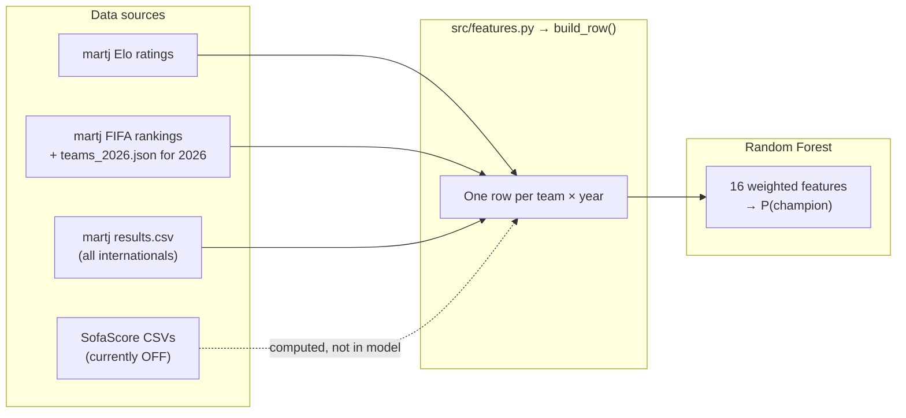

# Feature reference (what the model actually uses)

**Active model inputs: 16 columns** (`FEATURE_COLS` in `src/features.py`)

Everything else in `data/processed/team_2026_features.csv` is for inspection, export, or future use — **not** fed to the Random Forest unless it appears in the table below.

---

## At a glance



---

## The 16 columns in the model

| # | Column | Group | Source | Model weight | In `team_2026_features.csv`? |
|---|--------|-------|--------|--------------|------------------------------|
| 1 | `pre_wc_elo` | Strength | Elo file, rating before WC cutoff | 1× | Yes (`pre_wc_elo`) |
| 2 | `fifa_rank_score` | Strength | `1 / FIFA rank` (2026 ranks from `teams_2026.json`) | **4×** | Yes (`fifa_rank_score`; rank also as `pre_wc_fifa_rank`) |
| 3 | `last12mo_avg_opponent_elo` | Form / SOS | Same 12‑mo games as win %; opponent Elo at match date | 1× | Re-export needed¹ |
| 4 | `last12mo_win_pct` | Form | Wins / games in last 12 months (draws ≠ wins) | 1× | Yes |
| 5 | `last12mo_goals_for_per_match` | Form | martj `results.csv` | 1× | Yes |
| 6 | `last12mo_goals_against_per_match` | Form | martj `results.csv` | 1× | Yes |
| 7 | `last12mo_goal_diff_per_match` | Form | martj `results.csv` | 1× | Yes |
| 8 | `last12mo_matches_played` | Form | martj `results.csv` | 1× | Yes |
| 9 | `days_since_last_match` | Form | Days from last game to WC cutoff | 1× | Yes |
| 10 | `is_host` | Context | `WC_HOSTS` in `load_data.py` (2026: US, Canada, Mexico) | **0.25×** | Re-export needed¹ |
| 11 | `conf_UEFA` | Confederation | FIFA confederation one-hot | 1× | Yes |
| 12 | `conf_CONMEBOL` | Confederation | one-hot | 1× | Yes |
| 13 | `conf_CONCACAF` | Confederation | one-hot | 1× | Yes |
| 14 | `conf_CAF` | Confederation | one-hot | 1× | Yes |
| 15 | `conf_AFC` | Confederation | one-hot | 1× | Yes |
| 16 | `conf_OFC` | Confederation | one-hot | 1× | Yes |

¹ Older exports of `team_2026_features.csv` may omit `last12mo_avg_opponent_elo` and `is_host`. Regenerate:

```bash
cd World_Cup/scripts
python3 export_2026_features.py --years 2026
```

Weights are applied in `src/model.py` → `apply_feature_weights()` (CLI: `--fifa-score-weight`, `--host-weight`).

---

## Form window (columns 3–9)

All “last12mo_*” **form** stats share one definition:

- **Games:** every international in martj `data/kaggle/martj_dataset/results.csv`
- **Window:** `[cutoff − 12 months, cutoff)` — not SofaScore, not one competition
- **2026 cutoff:** `2026-06-11` (day before WC start)
- **Win:** strict W/L only (draws count as non-wins)
- **Missing games:** column medians at impute time (`_impute_features`)

Example — Brazil 2026: 8 games, **50%** win rate (`last12mo_win_pct = 0.5`).

---

## Computed but NOT in the model (export / debug only)

### SofaScore advanced — **disabled** (commented out of `FEATURE_COLS`)

| Column | Source | Status |
|--------|--------|--------|
| `last12mo_avg_possession` | SofaScore WC qual (2026) or WC finals (historical) | In CSV, **not in model** |
| `last12mo_pass_completion_pct` | SofaScore | In CSV, **not in model** |
| `last12mo_set_piece_success_rate` | SofaScore | In CSV, **not in model** |
| `last12mo_shots_on_target_pct` | SofaScore | In CSV, **not in model** |

See `docs/SOFASCORE.md` for fetch pipeline. Re-enable by uncommenting the four lines in `FEATURE_COLS`.

### Pedigree — never in the model

| Column | Meaning |
|--------|---------|
| `prior_wc_titles` | Titles before this WC |
| `prior_wc_finals` | Final appearances |
| `prior_wc_semifinals` | Same as finals in current code |
| `prior_wc_appearances` | WC apps before this year |
| `is_defending_champion` | Won previous WC |

### Other export-only

| Column | Meaning |
|--------|---------|
| `pre_wc_fifa_rank` | Raw rank (model uses `fifa_rank_score` = 1/rank) |
| `host_confederation_match` | Team confederation matches a host’s |
| `advanced_stats_source` | SofaScore year / competition id |
| `has_sofascore_advanced` | Whether SofaScore row exists |
| `advanced_any_imputed` | Whether penalty fill was applied |
| `raw_*` / `advanced_imputed_*` | SofaScore audit columns |

---

## Column count cheat sheet

| Set | Count | Used by RF? |
|-----|-------|-------------|
| **`FEATURE_COLS` (model)** | **16** | **Yes** |
| SofaScore advanced (`ADVANCED_COLS`) | 4 | No (disabled) |
| Pedigree (`PEDIGREE_COLS`) | 5 | No |
| Context export (`host_confederation_match`) | 1 | No |
| Confederation one-hots | 6 | Yes (included in the 16) |
| Typical `team_2026_features.csv` row width | ~37 | Mixed — see table above |

---

## Where things live in code

| What | Path |
|------|------|
| Feature lists & `build_row()` | `src/features.py` |
| Model matrix & weights | `src/model.py` |
| Match / Elo / FIFA loaders | `src/load_data.py` |
| SofaScore lookup | `src/sofascore_load.py` |
| Train + 2026 rankings | `scripts/train_and_predict.py` |
| Write inspection CSV | `scripts/export_2026_features.py` |
| 2026 inspection CSV | `data/processed/team_2026_features.csv` |
| All-year training CSV | `data/processed/team_year_features.csv` |

---

## Feature groups (visual)

```
MODEL INPUTS (16)
├── Strength (2 effective signals, 1 weighted)
│   ├── pre_wc_elo
│   └── fifa_rank_score  ← 4× weight
├── Form / schedule (7)
│   ├── last12mo_avg_opponent_elo
│   ├── last12mo_win_pct
│   ├── last12mo_goals_for_per_match
│   ├── last12mo_goals_against_per_match
│   ├── last12mo_goal_diff_per_match
│   ├── last12mo_matches_played
│   └── days_since_last_match
├── Host (1, 0.25× weight)
│   └── is_host
└── Confederation one-hot (6)
    └── conf_UEFA … conf_OFC

NOT IN MODEL
├── SofaScore advanced (4) — disabled
├── Pedigree (5)
└── Export metadata (raw_*, imputed flags, host_confederation_match)
```

---

## Defaults when training

- **Training window:** WC years ≥ 2006 (`--min-year`; often run with `--min-year 2010`)
- **Sample weights:** recency half-life 8 years (ref 2022)
- **Classifier:** `RandomForestClassifier`, 300 trees, `max_depth=10`, `class_weight='balanced'`
- **Output:** independent `P(champion)` per team; top‑32 shares normalized for display only
