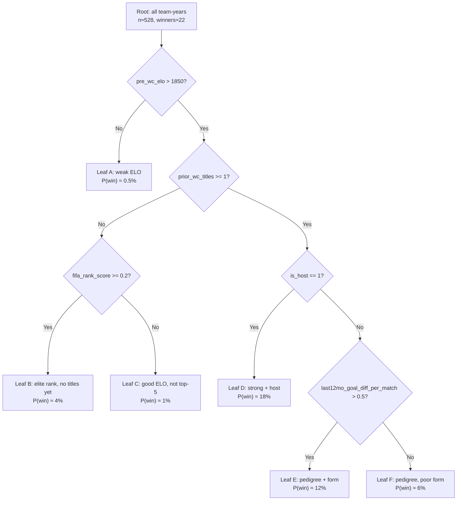
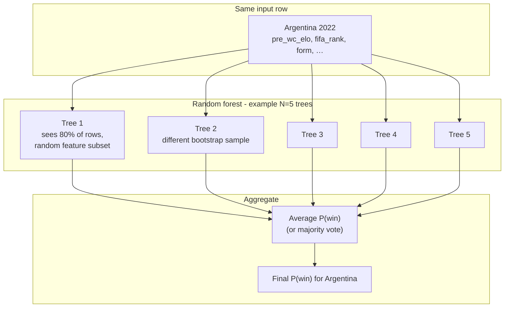
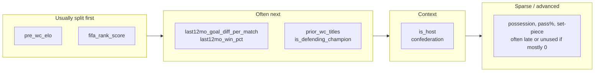

# Decision tree vs random forest (World Cup Predictor)

How a **single tree** and the **random forest** this project ships use the features to predict **“will this team win this World Cup?”** (`label = 1` for the champion, `0` for everyone else).

**This project uses Random Forest only** (no gradient boosting).

Each training row is one **(team, WC year)** pair — e.g. `(Brazil, 2022)`, `(Argentina, 2022)`, … with ~48 rows per tournament and exactly **one** `label = 1` per year.

---

## 1. What the model sees (one row)

Example row for **Argentina, 2022** (the actual winner):

| Feature | Example value | Role in tree |
|--------|---------------|--------------|
| `pre_wc_elo` | high | strength |
| `fifa_rank_score` | 1 / FIFA rank (higher = better) | strength |
| `pre_wc_fifa_rank` | in export CSV only, not in model | — |
| `last12mo_goal_diff_per_match` | positive | form |
| `prior_wc_titles` | 3 | pedigree |
| `is_host` | 0 | context |
| `last12mo_avg_possession` | maybe NaN → 0 | advanced |
| … | … | … |

The tree never sees “Argentina vs France” as one row — only **one team’s snapshot** for that year.

---

## 2. Single decision tree (one flowchart)

One tree = **one sequence of yes/no questions**. Every team-year walks from the **root** to **one leaf**. The leaf says something like “mostly non-winners” or “mostly winners.”

Below is a **toy** tree (thresholds are illustrative, not fitted on real data):



### How Argentina 2022 might traverse this toy tree

```text
pre_wc_elo > 1850?        → Yes
prior_wc_titles >= 1?     → Yes  (had titles before 2022)
is_host == 1?             → No
last12mo_goal_diff > 0.5? → Yes
→ lands in Leaf E → model assigns relatively high P(win)
```

### How a minnow might traverse the same tree

```text
pre_wc_elo > 1850?  → No
→ Leaf A immediately (one split, done)
→ very low P(win)
```

### Architecture in one picture

```text
                    [ ONE TREE ]
Input: feature vector x  (17+ numbers for one team-year)
        │
        ▼
   split → split → split → …  (depth limited, e.g. 3–8)
        │
        ▼
   exactly ONE leaf
        │
        ▼
Output: P(win) ≈ (wins in leaf) / (rows in leaf)
```

**Weakness on your data:** with only **22 winners**, one deep tree can memorize quirks (“if year≈2014 and team=Germany”) and fall apart on leave-one-WC-out CV.

---

## 3. Many trees — random forest (bagging)

**Idea:** train **many different trees** on random subsets of rows and random subsets of features, then **average** their predictions.



### Same team, five toy trees (why averaging helps)

| Tree | Path summary | P(win) from that tree |
|------|----------------|------------------------|
| 1 | high ELO → pedigree → good form | 12% |
| 2 | high ELO → top FIFA rank | 9% |
| 3 | high ELO → splits on possession (noisy) | 3% |
| 4 | host=0 → confederation=CONMEBOL → … | 10% |
| 5 | defending champion=0 → high ELO | 11% |
| **Forest output** | **mean** | **≈ 9%** |

Tree 3 might be wrong on its own; the forest **dampens** that outlier.

```text
         Tree_1(x) ──┐
         Tree_2(x) ──┤
         Tree_3(x) ──┼──►  mean  ──►  P(win | x)
         Tree_4(x) ──┤
         Tree_5(x) ──┘
```

Typical settings: **hundreds** of trees (e.g. 100–500), each shallow-ish (`max_depth` capped).

---

## 4. Side-by-side architecture

```text
┌─────────────────────────────────────────────────────────────────────────┐
│  SINGLE DECISION TREE                                                   │
│                                                                         │
│   features ──► [ one nested if/else chart ] ──► ONE leaf ──► P(win)    │
│                                                                         │
│   Risk: one weird branch fits "Germany 2014" only                       │
└─────────────────────────────────────────────────────────────────────────┘

┌─────────────────────────────────────────────────────────────────────────┐
│  RANDOM FOREST (many trees, parallel)                                   │
│                                                                         │
│   features ──► Tree_1 ──┐                                               │
│            ──► Tree_2 ──┤                                               │
│            ──►  …      ──┼──► average ──► P(win)                          │
│            ──► Tree_N ──┘                                               │
│                                                                         │
│   Trees differ: random rows + random features per tree                  │
└─────────────────────────────────────────────────────────────────────────┘

```

| | Single tree | Random forest (shipped) |
|--|-------------|-------------------------|
| **# trees** | 1 | 300 (default) |
| **How combined** | n/a | Average predicted P(win) across trees |
| **Variance** | High | Lower |
| **Interpretability** | Easiest (one path) | Feature importances |
| **Fit** | Exploratory only | **Shipped model** |

---

## 5. From P(win) to “predict the champion”

For **2026**, you build **48 rows** (one per entrant). Any model outputs `P(win)` per row. You **rank** teams:

```text
Brazil        0.11
France        0.09
Argentina     0.08
…
Curaçao       0.002   ← bottom

Predicted champion = argmax P(win)  →  Brazil  (example only)
```

Single tree: each team falls into **one leaf** → leaf rate can be jumpy (0%, 6%, 12%).

Forest: smoother spread across teams because many trees voted.

---

## 6. Feature groups → typical split order (intuition only)

Not learned from your data yet — just how trees *tend* to use groups when winning is rare:



Logistic regression uses **all features at once** in one formula; trees use **one feature at a time** at each split.

---

## 7. Recommendation

1. **Fit one shallow tree** (`max_depth=3`) → print the diagram / `export_graphviz` → see which features split first.
2. **Do not ship** that single tree as the final champion model.
3. Train **`RandomForestClassifier`** with **leave-one-WC-out CV** (top-1 / top-3 / top-5) via `scripts/train_and_predict.py`.
4. Rank the **48 teams in `teams_2026.json`** with the forest’s `P(win)` scores.

---

## Related files

- Feature list: [`../PLAN.md`](../PLAN.md)
- March Madness analog (logistic on diffs): [`../../../March_Madness/src/matchup_model.py`](../../../March_Madness/src/matchup_model.py)
